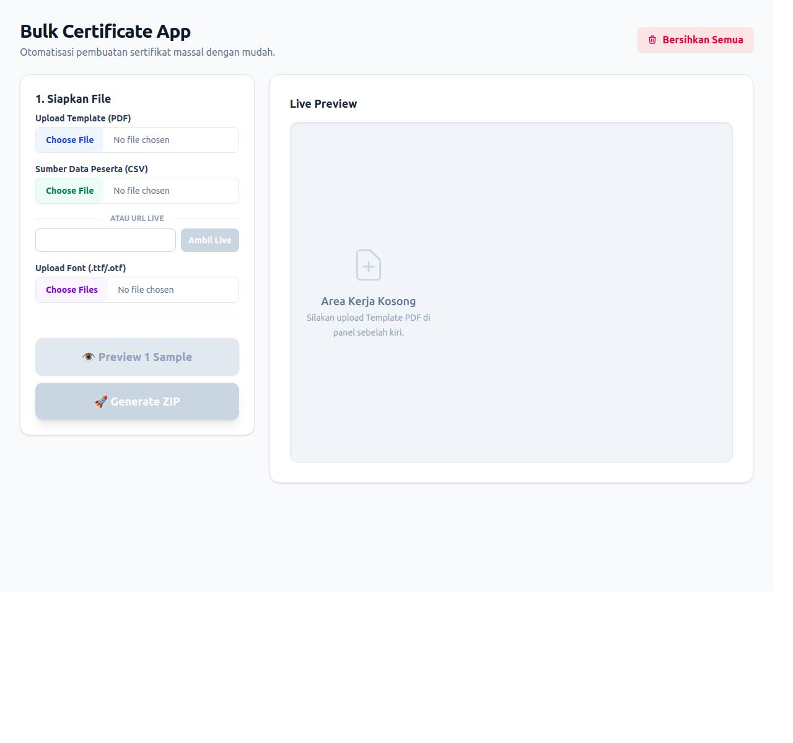

# 🧠 Certificate Generator Project
The Certificate Generator Project is a web application designed to generate certificates in bulk. It provides a user-friendly interface for customizing certificate templates, uploading data, and generating PDF certificates. The application is built using React, Vite, and various libraries for PDF generation and data parsing. The project aims to simplify the process of generating certificates, making it easier for organizations to produce high-quality certificates efficiently.

## 🚀 Features
- **Certificate Template Customization**: Customize certificate templates with fields, fonts, and colors.
- **Data Upload and Parsing**: Upload CSV data and parse it to generate certificates.
- **PDF Generation**: Generate PDF certificates in bulk using the uploaded data and customized templates.
- **Preview Feature**: Preview generated certificates before saving.
- **User-Friendly Interface**: Easy-to-use interface for managing application state and handling user interactions.

## 🛠️ Tech Stack
- **Frontend**: React, React DOM
- **Build Tool**: Vite
- **PDF Generation**: pdf-lib, pdfjs-dist
- **Data Parsing**: papaparse
- **File Handling**: jszip, file-saver
- **Styling**: Tailwind CSS

## 📦 Installation
To install the project, follow these steps:
1. Clone the repository using `git clone`.
2. Install dependencies using `npm install` or `yarn install`.
3. Start the development server using `npm run dev` or `yarn dev`.

## 💻 Usage
1. Upload a certificate template file.
2. Upload a CSV data file.
3. Customize the certificate template with fields, fonts, and colors.
4. Generate PDF certificates using the uploaded data and customized template.
5. Preview the generated certificates before saving.

## 📂 Project Structure
```markdown
.
├── public
├── src
│   ├── App.jsx
│   ├── main.jsx
│   └── ...
├── vite.config.js
├── package.json
└── ...
```

## 📸 Screenshots


## 🤝 Contributing
Contributions are welcome! To contribute, please submit a pull request with a detailed description of the changes.

## 📝 License
The project is licensed under the MIT License.

## 📬 Contact
For any questions or concerns, please contact us at [support@example.com](mailto:support@example.com).

## 💖 Thanks Message
Thank you for using the Certificate Generator Project! This project is designed to make certificate generation easier and more efficient. We hope you find it helpful.

This is written by [readme.ai](https://readme-generator-phi.vercel.app/)